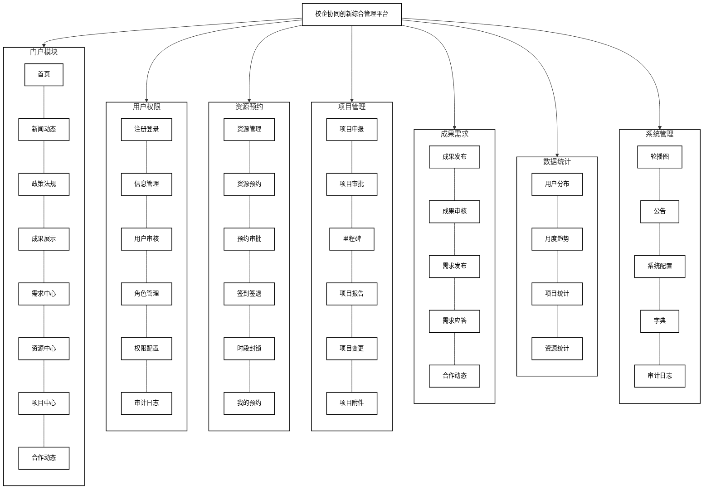

```mermaid
flowchart TB
    %% 顶级平台标题
    P[校企协同创新综合管理平台]

    %% 门户模块卡片
    subgraph M1 [门户模块]
        direction TB
        M1a[首页] --- M1b[新闻动态] --- M1c[政策法规] --- M1d[成果展示] --- M1e[需求中心] --- M1f[资源中心] --- M1g[项目中心] --- M1h[合作动态]
    end

    %% 用户权限卡片
    subgraph M2 [用户权限]
        direction TB
        M2a[注册登录] --- M2b[信息管理] --- M2c[用户审核] --- M2d[角色管理] --- M2e[权限配置] --- M2f[审计日志]
    end

    %% 资源预约卡片
    subgraph M3 [资源预约]
        direction TB
        M3a[资源管理] --- M3b[资源预约] --- M3c[预约审批] --- M3d[签到签退] --- M3e[时段封锁] --- M3f[我的预约]
    end

    %% 项目管理卡片
    subgraph M4 [项目管理]
        direction TB
        M4a[项目申报] --- M4b[项目审批] --- M4c[里程碑] --- M4d[项目报告] --- M4e[项目变更] --- M4f[项目附件]
    end

    %% 成果需求卡片
    subgraph M5 [成果需求]
        direction TB
        M5a[成果发布] --- M5b[成果审核] --- M5c[需求发布] --- M5d[需求应答] --- M5e[合作动态]
    end

    %% 数据统计卡片
    subgraph M6 [数据统计]
        direction TB
        M6a[用户分布] --- M6b[月度趋势] --- M6c[项目统计] --- M6d[资源统计]
    end

    %% 系统管理卡片
    subgraph M7 [系统管理]
        direction TB
        M7a[轮播图] --- M7b[公告] --- M7c[系统配置] --- M7d[字典] --- M7e[审计日志]
    end

    %% 核心控制：让 7 个子图（列）在平台下方横向并排摆放
    P --> M1
    P --> M2
    P --> M3
    P --> M4
    P --> M5
    P --> M6
    P --> M7

    %% 样式定义：白底黑边、宋体、五号字(10.5pt)
    classDef whiteTheme fill:#ffffff,stroke:#000000,stroke-width:1.5px,color:#000000,font-family:'SimSun','Songti SC',serif,font-size:10.5pt;
    
    %% 应用样式到所有节点
    class P,M1a,M1b,M1c,M1d,M1e,M1f,M1g,M1h,M2a,M2b,M2c,M2d,M2e,M2f,M3a,M3b,M3c,M3d,M3e,M3f,M4a,M4b,M4c,M4d,M4e,M4f,M5a,M5b,M5c,M5d,M5e,M6a,M6b,M6c,M6d,M7a,M7b,M7c,M7d,M7e whiteTheme;

    %% 子图（外框卡片）样式：白底黑边
    style M1 fill:#ffffff,stroke:#000000,stroke-width:1.5px;
    style M2 fill:#ffffff,stroke:#000000,stroke-width:1.5px;
    style M3 fill:#ffffff,stroke:#000000,stroke-width:1.5px;
    style M4 fill:#ffffff,stroke:#000000,stroke-width:1.5px;
    style M5 fill:#ffffff,stroke:#000000,stroke-width:1.5px;
    style M6 fill:#ffffff,stroke:#000000,stroke-width:1.5px;
    style M7 fill:#ffffff,stroke:#000000,stroke-width:1.5px;
```