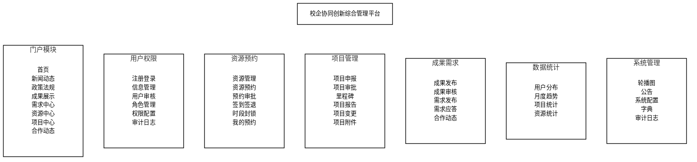

```mermaid
flowchart TB
    %% 顶级平台标题
    P[校企协同创新综合管理平台]

    %% 门户模块卡片（使用换行符实现无边框无线条堆叠）
    subgraph M1 [门户模块]
        M1_List[首页<br/>新闻动态<br/>政策法规<br/>成果展示<br/>需求中心<br/>资源中心<br/>项目中心<br/>合作动态]
    end

    %% 用户权限卡片
    subgraph M2 [用户权限]
        M2_List[注册登录<br/>信息管理<br/>用户审核<br/>角色管理<br/>权限配置<br/>审计日志]
    end

    %% 资源预约卡片
    subgraph M3 [资源预约]
        M3_List[资源管理<br/>资源预约<br/>预约审批<br/>签到签退<br/>时段封锁<br/>我的预约]
    end

    %% 项目管理卡片
    subgraph M4 [项目管理]
        M4_List[项目申报<br/>项目审批<br/>里程碑<br/>项目报告<br/>项目变更<br/>项目附件]
    end

    %% 成果需求卡片
    subgraph M5 [成果需求]
        M5_List[成果发布<br/>成果审核<br/>需求发布<br/>需求应答<br/>合作动态]
    end

    %% 数据统计卡片
    subgraph M6 [数据统计]
        M6_List[用户分布<br/>月度趋势<br/>项目统计<br/>资源统计]
    end

    %% 系统管理卡片
    subgraph M7 [系统管理]
        M7_List[轮播图<br/>公告<br/>系统配置<br/>字典<br/>审计日志]
    end

    %% 核心控制：让 7 个子图（列）在平台下方横向并排摆放（此处连线可根据需要保留或用 ~~~ 隐藏，这里用隐形边保持结构）
    P ~~~ M1
    P ~~~ M2
    P ~~~ M3
    P ~~~ M4
    P ~~~ M5
    P ~~~ M6
    P ~~~ M7

    %% 样式定义：白底黑边、无多余内框、宋体、五号字(10.5pt)
    classDef whiteTheme fill:#ffffff,stroke:#000000,stroke-width:1.5px,color:#000000,font-family:'SimSun','Songti SC',serif,font-size:10.5pt;
    classDef noBorder fill:none,stroke:none,color:#000000,font-family:'SimSun','Songti SC',serif,font-size:10.5pt,text-align:center;
    
    %% 应用样式
    class P whiteTheme;
    class M1_List,M2_List,M3_List,M4_List,M5_List,M6_List,M7_List noBorder;

    %% 子图（外框卡片）样式：白底黑边
    style M1 fill:#ffffff,stroke:#000000,stroke-width:1.5px;
    style M2 fill:#ffffff,stroke:#000000,stroke-width:1.5px;
    style M3 fill:#ffffff,stroke:#000000,stroke-width:1.5px;
    style M4 fill:#ffffff,stroke:#000000,stroke-width:1.5px;
    style M5 fill:#ffffff,stroke:#000000,stroke-width:1.5px;
    style M6 fill:#ffffff,stroke:#000000,stroke-width:1.5px;
    style M7 fill:#ffffff,stroke:#000000,stroke-width:1.5px;
```