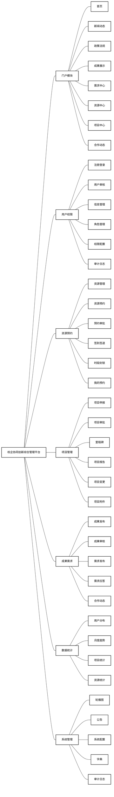

```mermaid
graph LR
    %% 核心顶层系统
    P[校企协同创新综合管理平台]

    %% 一级模块定义
    M1[门户模块]
    M2[用户权限]
    M3[资源预约]
    M4[项目管理]
    M5[成果需求]
    M6[数据统计]
    M7[系统管理]

    %% 核心到一级模块的连接
    P --- M1 & M2 & M3 & M4 & M5 & M6 & M7

    %% 二级子功能连接
    M1 --- M1a[首页] & M1b[新闻动态] & M1c[政策法规] & M1d[成果展示] & M1e[需求中心] & M1f[资源中心] & M1g[项目中心] & M1h[合作动态]
    M2 --- M2a[注册登录] & M2b[用户审核] & M2c[信息管理] & M2d[角色管理] & M2e[权限配置] & M2f[审计日志]
    M3 --- M3a[资源管理] & M3b[资源预约] & M3c[预约审批] & M3d[签到签退] & M3e[时段封锁] & M3f[我的预约]
    M4 --- M4a[项目申报] & M4b[项目审批] & M4c[里程碑] & M4d[项目报告] & M4e[项目变更] & M4f[项目附件]
    M5 --- M5a[成果发布] & M5b[成果审核] & M5c[需求发布] & M5d[需求应答] & M5e[合作动态]
    M6 --- M6a[用户分布] & M6b[月度趋势] & M6c[项目统计] & M6d[资源统计]
    M7 --- M7a[轮播图] & M7b[公告] & M7c[系统配置] & M7d[字典] & M7e[审计日志]

    %% 样式定义：白底黑边、宋体、五号字(10.5pt)
    classDef whiteTheme fill:#ffffff,stroke:#000000,stroke-width:1.5px,color:#000000,font-family:'SimSun','Songti SC',serif,font-size:10.5pt;
    
    %% 应用样式到所有节点
    class P,M1,M2,M3,M4,M5,M6,M7,M1a,M1b,M1c,M1d,M1e,M1f,M1g,M1h,M2a,M2b,M2c,M2d,M2e,M2f,M3a,M3b,M3c,M3d,M3e,M3f,M4a,M4b,M4c,M4d,M4e,M4f,M5a,M5b,M5c,M5d,M5e,M6a,M6b,M6c,M6d,M7a,M7b,M7c,M7d,M7e whiteTheme;
```