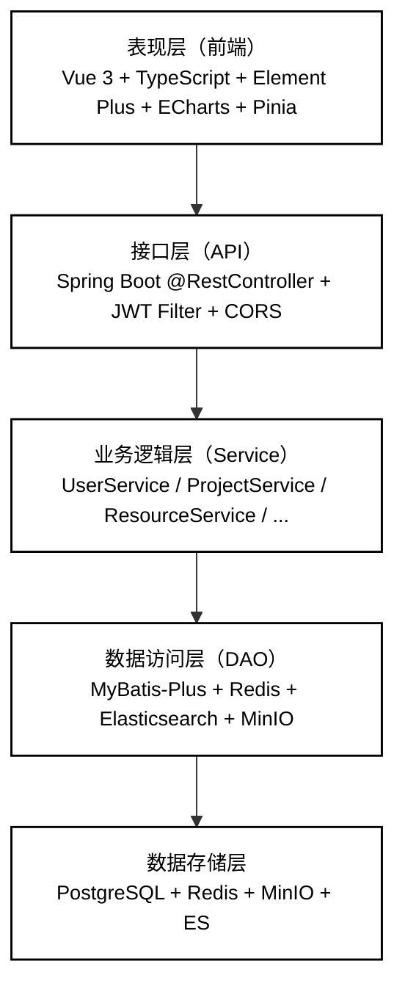

```mermaid
flowchart TD
    A["表现层（前端）<br>Vue 3 + TypeScript + Element Plus + ECharts + Pinia"]
    B["接口层（API）<br>Spring Boot @RestController + JWT Filter + CORS"]
    C["业务逻辑层（Service）<br>UserService / ProjectService / ResourceService / ..."]
    D["数据访问层（DAO）<br>MyBatis-Plus + Redis + Elasticsearch + MinIO"]
    E["数据存储层<br>PostgreSQL + Redis + MinIO + ES"]

    A --> B
    B --> C
    C --> D
    D --> E

    classDef layerStyle fill:#ffffff,stroke:#000000,stroke-width:1.5px,color:#000000,SimSun,font-size:10.5pt,text-align:center;
    class A,B,C,D,E layerStyle;
```